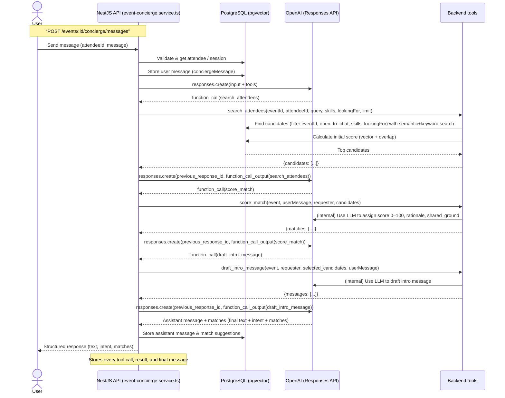

# MyConnect.ai test by Naufal

## Run instructions

### Setup environment

```bash
cp .env.example .env
```

then fill openAI `apiKey` to `.env` file.

### Run in docker

```bash
docker compose up -d
pnpm exec prisma migrate deploy

# optional for seeder data
pnpm prisma:seed
```

### Diagram



## Trande-offs and "What I'd do with more time"

### Trade offs

#### Batch scoring

`score_match` processes all candidates returned by `search_attendees` as a batch.

Trade-off:

- This reduces latency and token usage.
- However, a per-candidate scoring process could allow deeper individual evaluation.

#### Batch intro generation

`draft_intro_message` is also handled as a batch process for selected candidates.

Trade-off:

- This avoids multiple repeated model calls.
- However, a more personalized per-candidate generation step could improve quality.

## What I would do with more time

With more time, I would improve the system in these areas:

1. **Observability**
   - Add structured logs.
   - Track DB latency, tool latency, OpenAI latency, token usage, and error rate.
   - Add tracing across API, tools, DB, and model calls.
   - Integrate logs to cloudwatch by using `nestjs-pino` for structured JSON logs
    then setup CloudWatch Log group with proper retention and permission,
    and also configure environments for aws and cloudwatch log for this project.
2. **Production hardening**
   - Add rate limiting.
   - Add request timeouts.
   - Add fallback behavior if the model provider is unavailable.
   - Add stricter PII controls and retention policies.

## How to run the tests

to run e2e test run commands below:

```bash
# make sure you install dependecies by run this command
pnpm i

# run e2e test
pnpm test:e2e
```

## Development notes

```bash
# Create migration file without applying it to db
pnpm exec prisma migrate dev --create-only

# apply migration for dev
pnpm exec prisma migrate dev

# run seeding
pnpm prisma:seed
```

## Notes

1. for `Conversation state` I considered to save the state manually into db to keep this project simple and future consideration for other LLM providers.
2. openAI with model text-embedding-3-small fit for vector(1536) in postgres.

## What I am most proud of

The most important design decision is the tool based orchestration.

Instead of having the LLM generate everything directly, the system separates responsibilities:

- `search_attendees` retrieves candidates from the database,
- `score_match` reasons over the batch of candidates,
- `draft_intro_message` generates communication text,
- the final assistant response summarizes the recommendation.

This makes the flow easier to debug, test, and scale.

The second design decision I am proud of is batch processing for `score_match` and `draft_intro_message`. This avoids one LLM call per attendee and keeps the endpoint more efficient.

## Architecture

### Questions

1. Why you chose your agent framework / vector store / LLM.
   - I chose pgvector because I'm familiar with it to embed specific data.
   - I chose OpenAI provider because I'm familiar to use their sdk native in javascript and used to use their products like codex and chatgpt for day-to-day work.
2. How the agent state is persisted and resumed.
   - I saved the conversation data into database and then to resume the conversation
    I'll call the data and send it back to OpenAI sdk.
3. How you'd scale this to 10k concurrent attendees at a single event.
   - I’ll set up replicas and PgBouncer for Postgres to separate read and write workloads. This should improve read query performance, since read operations will be handled by the replicas.
   - I’ll deploy this application to a Kubernetes cluster and set up autoscaling for the deployment, so it can increase the number of replicas when request workload is high.
   - I’d move embedding work to background jobs and add queueing for LLM heavy flows.
4. How you'd handle PII / data protection (relevant if MyConnect operates in
jurisdictions with strict data laws)
    - I would avoid logging raw profiles, raw chat content, or full prompt/tool payloads in production.
    - I would define retention and deletion policies for attendee and conversation data, especially if operating in stricter privacy jurisdictions.
    - I would refactor my code to only send the data to LLM that required for matching and recommendation generation.
